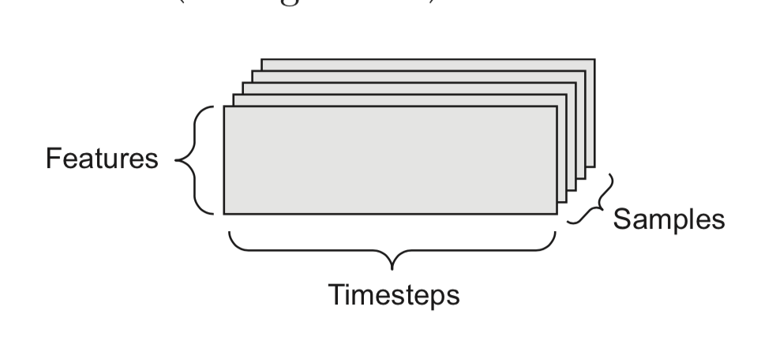

## 2.1 Neural Network

1. Compilation Step:

    + *Loss function*: how network will be able to measure performance on the training data. **categorical_crossentropy**
    + *categorical_crossentropy* is the loss function that’s used as a feedback signal for learning the weight tensors, and which the training phase will attempt to minimize
    + *Optimizer*: Mechanism the network update itself based on data it sess and loss function **rmsprop*
    + *Metrics*: accuracy
    ```python
    test_loss, test_acc = network.evaluate(test_images, test_labels)
    print(test_acc)
    ```
    If the evaluation is less than training data, this is an example of *overfitting*
    
2. Data representations for neural networks:
    + **tensor**: container for data (number). Generalization of matrices to an arbitrary number of dimensions
    + **scalars**: tensor contains only one number 
    + **vectors**:  Array of numbers
    + **matrices**: 2D Tensor
    + **Key attributes**: 
        + *Number of axes*: 3D tensor has three axes, and a matrix has two axes. This is also called the tensor's ndim 
        + *Shape*: Tuple of int
        + *Data Type*
        
3. Data Batches:
    + First axis (axis 0) in all data tensors you'll come across will be *samples*
    + Deep-Learning Models don't process an entire dataset at once; rather, they break the data into small batches -> First axis will become the *batch axis*

4. Timeseries data:
    
    + 3D tensor with explicit time axis. Each sample can be encoded as a sequence of vectors
    + Time axis is always the second axis by convention

5. Image data:
    + samples, height, width, color depth
    
6. Video data:
    + 5D tensor: (samples, frames, height, width, color_depth)
    
7. Tensor operations:
    ```python
    output = relu(dot(W, input) + b)
    ```

8. Element-wise operations:
    + Relu operation and addition are *element-wise*
    ```python
    def naive_relu(x):
        assert len(x.shape) == 2 x is a 2D Numpy tensor.
        x = x.copy()
        for i in range(x.shape[0]):
            for j in range(x.shape[1]):
                x[i, j] = max(x[i, j], 0)
        return x
    ```
    
9. Broadcasting:
    + Happens when shapes of 2 tensors are different
    + Smaller tensor will be broadcasted to match the shape of larger tensor
10. Tensor dot:
    + Combines entries in the input tensors
11. Tensor reshape:
    + Preprocess the digits data before feeding into our network

## 2.4-Engine of neural networks: gradient-based optimization

1. Derivative of a tensor operation: 
    + *gradient* is called the derivative of a tensor operation.
    ```python
    y_pred = dot(W, x)
    loss_Value = loss(y_pred, y)
    ```
    + If data inputs x and y are frozen, then *loss_value* could be:
    ```python
    loss_value = f(W)
    ```
2. **Stochastic gradient descent**:
    + To compute the minimum loss values of weight. You can follow the step by this algorithm
    ```
    1 Draw a batch of training samples x and corresponding targets y.
    2 Run the network on x to obtain predictions y_pred.
    3 Compute the loss of the network on the batch, a measure of the mismatch
    between y_pred and y.
    4 Compute the gradient of the loss with regard to the network’s parameters (a
    backward pass).
    5 Move the parameters a little in the opposite direction from the gradient—for
    example W -= step * gradient—thus reducing the loss on the batch a bit.
    ```
    + The approach is *mini-batch stochastic gradient descent*
    + To avoid algorithm to not realize the global minimum. You use *momentum*. It's like rolling a ball down and if it has enough momentum, the ball will not get stuck in a ravine
    ```python
    past_velocity = 0. Constant momentum factor
    momentum = 0.1
    while loss > 0.01:
       w, loss, gradient = get_current_parameters()
       velocity = past_velocity * momentum + learning_rate * gradient
       w = w + momentum * velocity - learning_rate * gradient
       past_velocity = velocity
       update_parameter(w)
    ```

3. **Chaining derivatives: The Backpropagation algorithm**:
    + Start with final loss value and works backward from the top layers to be bottom layers, applying chain rule to compute the contribution that each params had in the loss value
    + Nowadays, Tensorflow has *symbolic differentiation* implementation that maps network paramter values to gradient values. Therefore, backward pass is reduced 
    
4. **Examples**:

```python

(train_images, train_labels), (test_images, test_labels) = mnist.load_data()
train_images = train_images.reshape((60000, 28 * 28))
train_images = train_images.astype('float32') / 255
test_images = test_images.reshape((10000, 28 * 28))
test_images = test_images.astype('float32') / 255

#Network contains two Dense layers 

network = models.Sequential()
network.add(layers.Dense(512, activation='relu', input_shape=(28 * 28,)))
network.add(layers.Dense(10, activation='softmax'))

#Compile
network.compile(optimizer='rmsprop',
                loss='categorical_crossentropy',
                metrics=['accuracy'])
                
#Training Loop
network.fit(train_images, train_labels, epochs=5, batch_size=128)

```

**The network will start to iterate on the training data in mini-batches of 128 samples, 5 times over (each iteration over all the training data is called an epoch). At each iteration, the network will compute the gradients of the weights with regard to the loss on the batch, and update the weights accordingly. After these 5 epochs, the network will have performed 2,345 gradient updates (469 per epoch), and the loss of the network will be sufficiently low that the network will be capable of classifying handwritten digits with high accuracy.**
