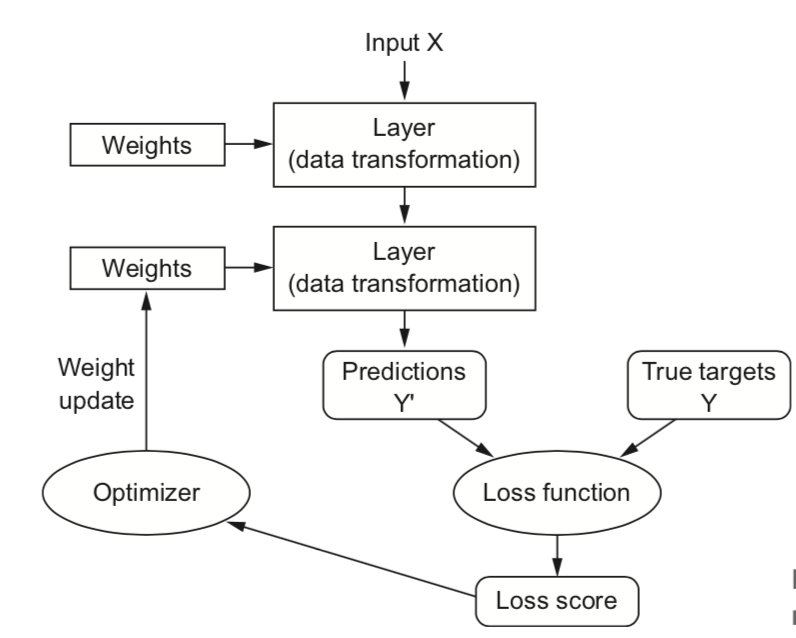
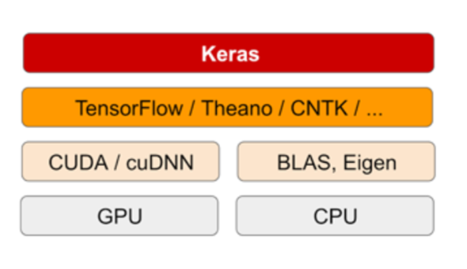

## 3.1 Anatomy of neural network

+ A relationship between layers, loss and optimizer



1. **Layer**: 
    + Building block of deep-learning
    ```python
    from keras import models
    from keras import layers
    model = models.Sequential()
    model.add(layers.Dense(32, input_shape=(784,)))
    model.add(layers.Dense(32))
    ```
    
2. **Models**:
    + Different network architecture

3. **Loss functions and optimizers**:
    + *Loss function*: The quantity that will be minimized during training
    + *Optimizer*: Determines how the network will be updated based on the loss function
    
## 3.2 Keras:



+ Keras is a model-level library, providing high-level building blocks for developing deep-learning models.

+ It's running under *backend engines* such as Tensorflow/Theano/CNTK


+ Two ways to define a model:
    1. *Sequential*: linear stacks of layers, which is the most common network architecture by far
    ```python
    from keras import models
    from keras import layers
    model = models.Sequential()
    model.add(layers.Dense(32, activation='relu', input_shape=(784,)))
    model.add(layers.Dense(10, activation='softmax'))
    ```
    2. *functional API*: directed acyclic graphs of layers, which lets you build completely arbitrary architectures
    ```python
    input_tensor = layers.Input(shape=(784,))
    x = layers.Dense(32, activation='relu')(input_tensor)
    output_tensor = layers.Dense(10, activation='softmax')(x)
    model = models.Model(inputs=input_tensor, outputs=output_tensor)
    ```
    
## 3.4 IMDB

+ Relu function (rectified linear unit) is a function meant to zero out nagative values
+ Sigmoid squashes arbitrary values into 0 - 1 interval
+ *Crossentropy* is used more with models that output probabilities. It is a quantity from the field of Information Theory that measures the distance between probability distributions

## 3.5 Reuter Classification

spare_categorical_crossentropy is used with integer labels
  