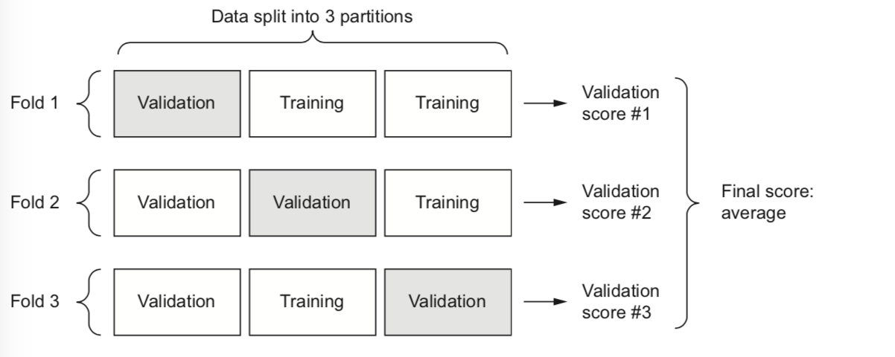

## 4.1 Branches of ML:

1. **Supervised learning**:
    + *Sequence generation* - given picture, predict a caption describing it.
    + *Syntax tree prediction* - given a sentence, predict its decomposition into a syntax tree
    + *Object detection* - given a picture, draw a bounding box
    + *Image segmentation* - given a picture, draw a pixel-level mask
    
2. **Unsupervised learning**: 
    + Finding interesting transformations of the input data without the help of any targets, for the purposes of data visualization, data compression, or data denoising.
    
3. **Self-supervised learning**:
    + No human interaction
    + Example is *autoencoders* 
    + Guessing next frame in a video given past frames etc.
    
4. **Reinforcement Learning**:
    + Agent receives information about its environment and learns to choose actions that will maximize some reward
    
## 4.2 Evaluate ML Models:

1. **Training, validation, and test sets**
    + *Simple hold-out validation*: Set apart fraction of data as test set, train on the remaining data and evaluate on the test set.
    + *Simple hold-out validation* suffers from one flaw: **If little data is available, then your validation and test sets may contain too few samples to be statistically representative of the data at hand**. This can be easily found out by shuffling the data and if data yielding different measures of model perfomance, you're having this issue
    
    *K-fold validation*
    + Split data into K partitions of equal size. Each partition i, train a model on the remaining K-1 partitions, and evaluate it on partition i.
    + Helpful when perfomance of your model shows significant variance based on your train test split. 
    
    
    *Iterated K-fold validation with shuffling*
    + For situation with relatively little data available and need to evaluate your model as precisely as possible
    + Apply k-fold validation multiple times, shuffling the data every time before splitting it K ways. 
    + The final score is the average of the scores obtained at each run of K-fold validation

2. **Things to keep in mind**:
    + *Data representativeness*: If your data is in order, you could mistakenly retrieve not enough information by using 80-20 split
    + *Arrow of time*
    + *Redundancy in your data* 

## 4.3 Data preprocessing, feature engineering:

1. **Data preprocessing in neural networks**